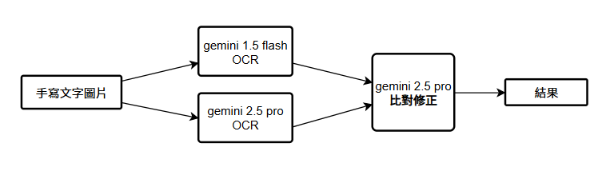

# Gemini AI 雙模型 OCR 校對系統

這是一個進階的 OCR 處理系統，它利用兩個不同的 Google Gemini 模型 (`gemini-2.5-pro` 和 `gemini-1.5-flash`) 對圖片進行光學字元辨識，並進一步使用 `gemini-2.5-pro` 模型對兩個初步結果進行分析、校對與融合，以產生一份高精度的最終文本。

## 流程圖



## ✨ 核心功能

- **雙模型 OCR**：同時使用 `gemini-2.5-pro` 和 `gemini-1.5-flash` 進行辨識，實現交叉驗證。
- **錯誤重試機制**：在 OCR 過程中，如果遇到可恢復的 API 錯誤（如超載、超時），系統會自動重試，提高執行的成功率。
- **AI 驅動的校對與融合**：不僅是比較文本差異，而是利用強大的 `gemini-2.5-pro` 模型作為「校對專家」，分析兩個初步結果的優劣，並生成一份語意通順、格式正確的最終版本。
- **自動化流程**：只需兩個步驟即可完成從圖片到最終校對文本的完整流程。
- **多格式輸出**：所有結果（包括初步和最終版本）都會同時儲存為純文字 (`.txt`) 和 Word (`.docx`) 檔案。

## 📂 專案結構

```
MoOCR/
├── .env                  # 存放您的 API 金鑰
├── input/                # 放置您要辨識的圖片
│   ├── 1.png
│   └── 2.png
├── output/
│   ├── gemini-2.5-pro/     # pro 模型的初步 OCR 結果
│   ├── gemini-1.5-flash/   # flash 模型的初步 OCR 結果
│   └── final_corrected/    # 經過 AI 校對與融合後的最終結果
├── pic.png               # 系統流程圖
├── gemini_ocr.py         # 步驟 1：執行雙模型 OCR 的腳本
├── synthesize_results.py   # 步驟 2：執行分析與融合的腳本
└── readme.md               # 本說明檔案
```

## 🚀 事前準備

在執行此腳本之前，請確保您已完成以下設定。

### 1. 取得 Google Gemini API 金鑰

- 前往 [Google AI for Developers](https://makersuite.google.com/app/apikey) 網站。
- 點擊 **"Create API key"** 來產生您的專屬金鑰。

### 2. 安裝 Python 函式庫

開啟您的終端機或命令提示字元，然後執行以下指令來安裝必要的 Python 套件：

```bash
pip install google-generativeai pillow python-docx python-dotenv
```

### 3. 設定 API 金鑰

1.  在專案資料夾中建立一個名為 `.env` 的檔案。
2.  用文字編輯器打開 `.env` 檔案。
3.  將 `YOUR_API_KEY_HERE` 替換成您在步驟 1 中取得的真實 Gemini API 金鑰，然後儲存檔案。

    ```
    GEMINI_API_KEY="替換成您的API金鑰"
    ```

## 🛠️ 如何使用

請依照以下兩個步驟順序執行。

### 步驟 1：執行雙模型 OCR

這個步驟會對 `input/` 資料夾中的所有圖片進行初步的 OCR 辨識。

1.  **準備圖片**
    -   將所有您想要辨識的圖片檔案 (如 `.png`, `.jpg` 等) 放入 `input` 資料夾中。

2.  **執行 OCR 腳本**
    -   開啟終端機，並切換到專案根目錄。
    -   執行以下指令：
        ```bash
        python gemini_ocr.py
        ```
    -   腳本會自動處理所有圖片，並將 `gemini-2.5-pro` 和 `gemini-1.5-flash` 的結果分別存放在對應的 `output/` 子資料夾中。

### 步驟 2：執行分析與融合

在初步 OCR 完成後，執行此步驟來產生最終的校對版本。

1.  **執行融合腳本**
    -   繼續在終端機中，執行以下指令：
        ```bash
        python synthesize_results.py
        ```
    -   腳本會讀取兩個模型的初步結果，呼叫 AI 進行分析校對，並將最理想的最終版本儲存起來。

### 步驟 3：檢查最終結果

-   前往 `output/final_corrected/` 資料夾。
-   這裡的 `.txt` 和 `.docx` 檔案就是經過 AI 校對和融合後的最終高品質文本。


---


<table>
  <tr>
    <td>
        測試題目
        今天天氣很好，我們下午去公園散步。
        請在下午3點前，到A棟201號會議室開會。
        我辨認出臺灣的鳳梨酥包裝袋很精緻。
        你真的相信「天下沒有白吃的午餐」這句話嗎？
    </td>
    <td>
        最終結果
        今天天氣很好，我們下午去公園散步。
        請在下午3點前，到A棟201號會議室開會。
        我辨認出臺灣的鳳梨酥包裝袋很精緻。
        你真的相信「天下沒有白吃的午餐」這句話嗎？
    </td>
  </tr>
  <tr>
    <td>
        gemini-1.5-flash
        今天天氣很好，我們下午去公園散步。
        請在下午3點前，到日棟201號會議室開會。
        我辨認出台灣的鳳梨酥包裝袋很精緻。
        你真的相信「天下沒有白吃的午餐」這句話嗎？        
    </td>
    <td>
        gemini-2.5-pro
        今天天氣很好,我們下午去公園散步。
        請在下午3點前,到A棟201號會議室開會。
        我辨認出臺灣的鳳梨酥包裝袋很精緻。
        你真的相信「天下沒有白吃的午餐」這句話嗎?
    </td>
  </tr>
</table>
